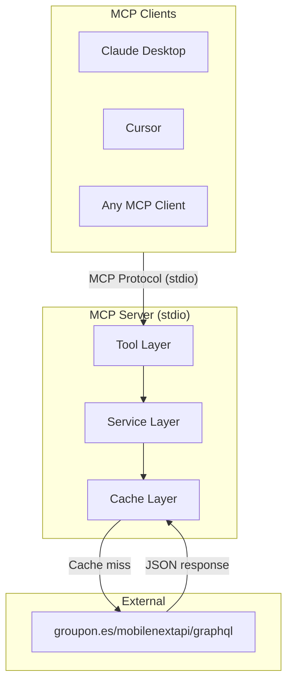
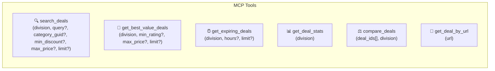
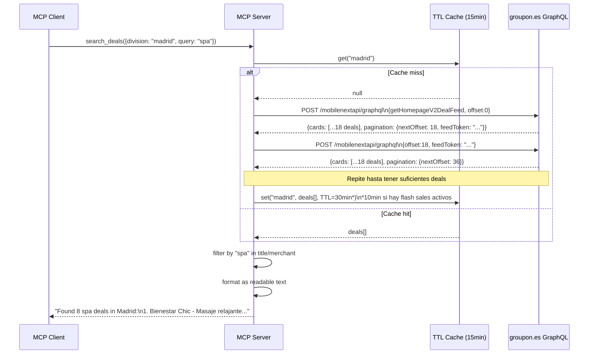
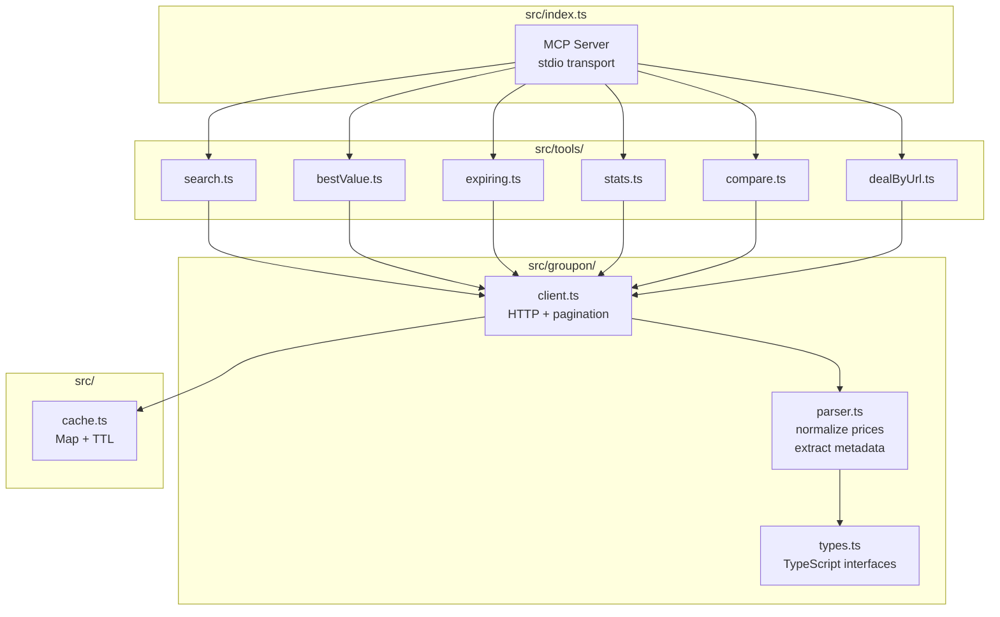
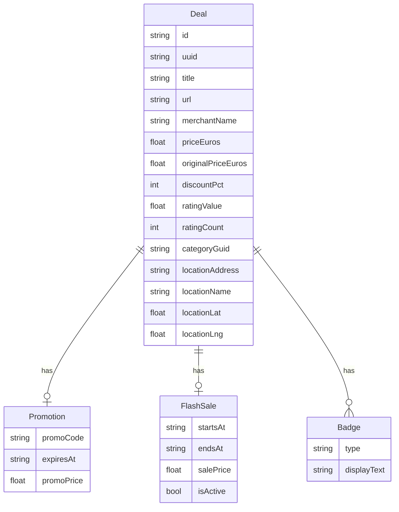
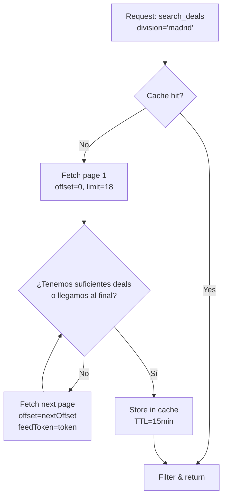
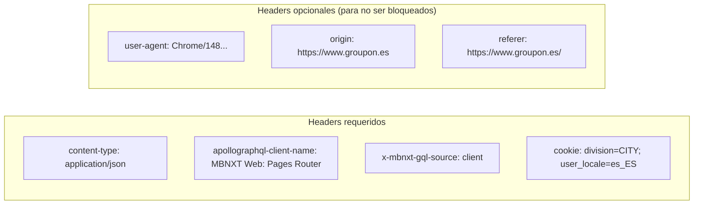

# Architecture — MCP Server for Groupon.es Deal Intelligence

## 1. Vista general del sistema



---

## 2. Tool Layer — qué expone el servidor



> **Limitación conocida de `search_deals`**: el filtrado por `query` opera sobre título y nombre de comerciante post-fetch. Búsquedas semánticas abiertas ("restaurantes románticos") pueden tener baja cobertura. Para mayor precisión usar `category_guid`.

---

## 3. Flujo de datos completo



---

## 4. Estructura interna del servidor



---

## 5. Modelo de datos normalizado



---

## 6. Estrategia de paginación



> **Nota sobre paginación**: Para `search_deals` con keyword se fetchan hasta 5 páginas (90 deals) para tener cobertura suficiente antes de filtrar. Para `get_deal_stats` se puede ir a más. Cada tool controla su propio límite de páginas.

---

## 7. Headers de la API



---

## 8. Decisiones de diseño

| Pregunta | Decisión | Razón |
|----------|----------|-------|
| ¿Transport? | `stdio` | Estándar MCP para servidores locales; HTTP+SSE sería over-engineering para este scope |
| ¿Divisions hardcodeadas o dinámicas? | Lista fija de ~12 ciudades ES como enum validado | Evita llamadas de discovery; el conjunto de ciudades de Groupon.es es estable |
| ¿Cuántos deals por defecto? | 3 páginas (54 deals) | Balance entre cobertura y latencia; configurable por tool |
| ¿Tool de geolocalización? | Fuera de scope v1 | Extensión natural: `get_nearby_deals(lat, lng)` una vez se tenga el endpoint correcto |
| ¿TTL de cache? | 30min base; 10min si hay flash sales activos en el lote | Flash sales cambian estado en horas, pero re-fetchear cada 15min es innecesario sin sales activos |

### Divisions soportadas (v1)

```typescript
const DIVISIONS = [
  "madrid", "barcelona", "valencia", "sevilla", "bilbao",
  "malaga", "zaragoza", "murcia", "palma", "alicante",
  "valladolid", "granada"
] as const;

type Division = typeof DIVISIONS[number];
```

### Extensiones naturales (post-v1)
- `get_nearby_deals(lat, lng, radius_km)` — geolocalización real
- Transport HTTP+SSE para uso remoto / multi-cliente
- Búsqueda semántica con embeddings sobre el corpus de deals cacheado
