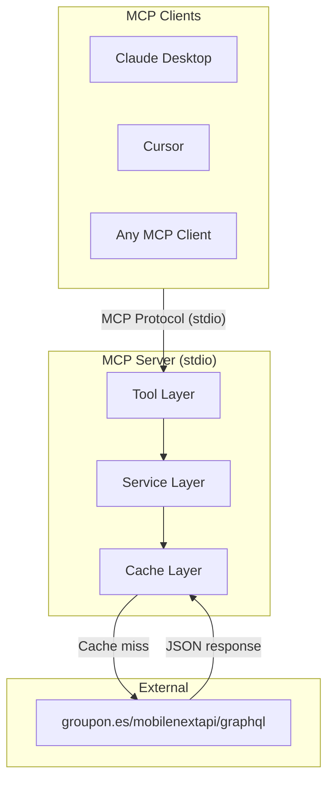
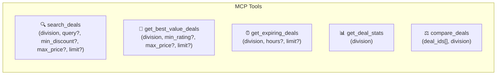
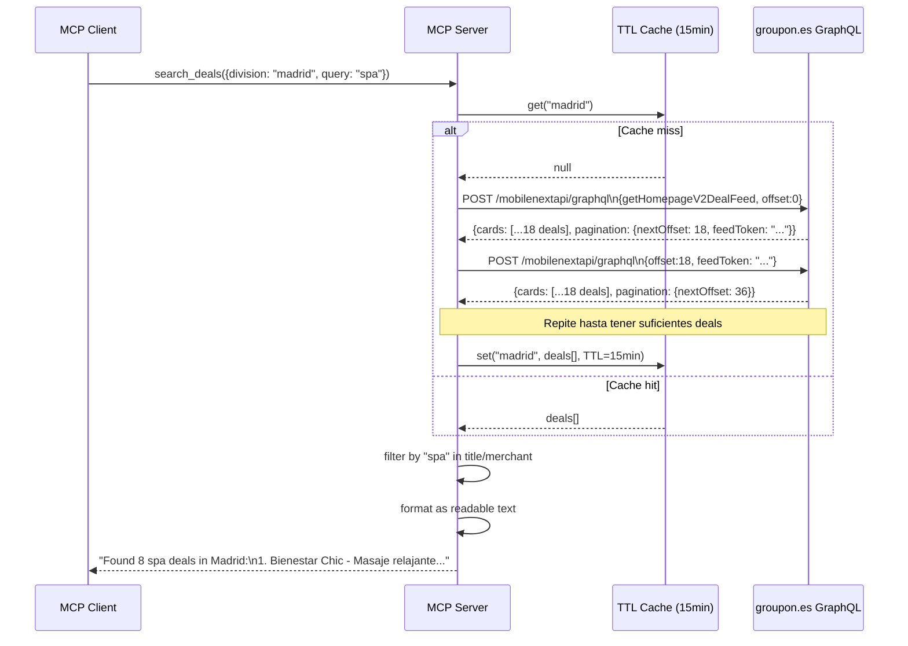
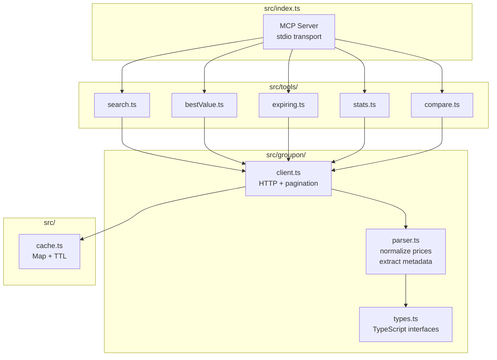
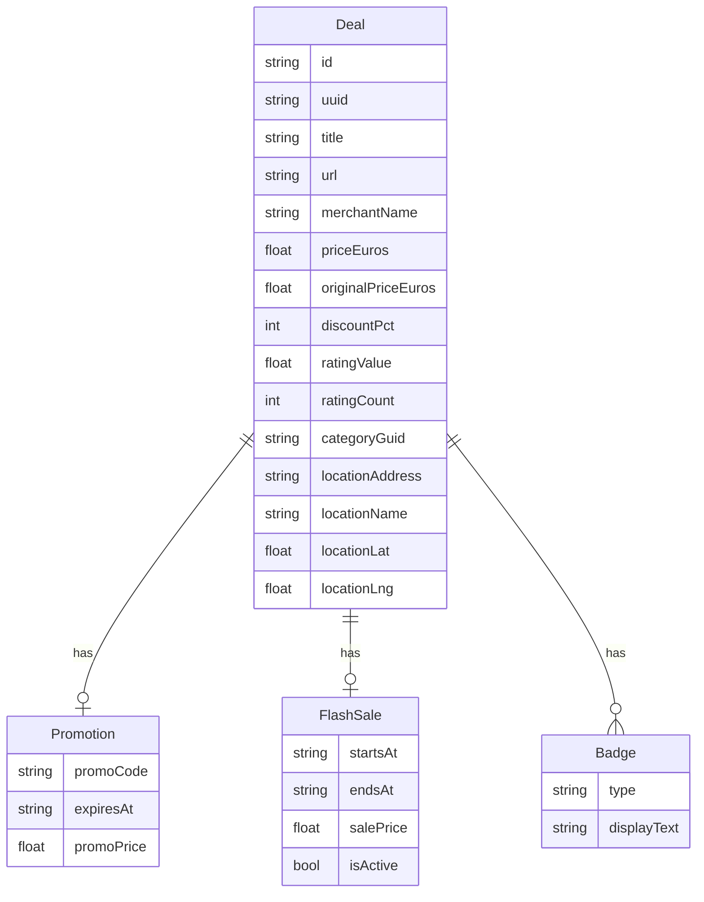
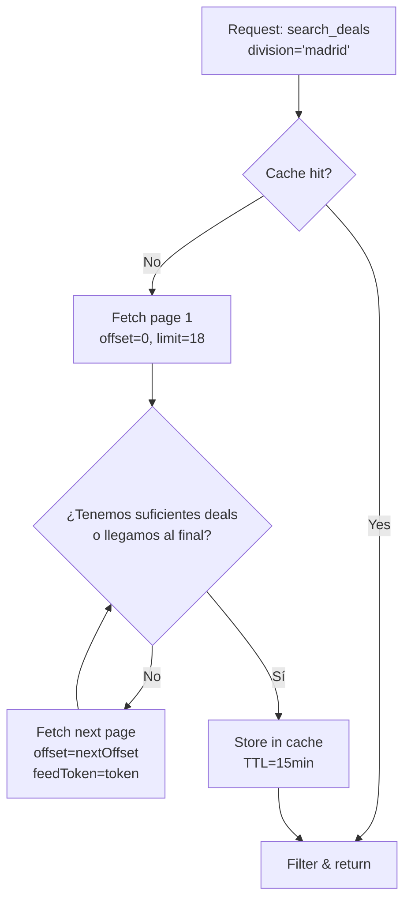
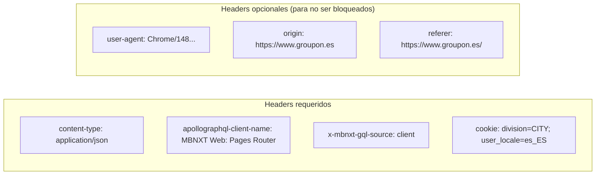

# Architecture — MCP Server for Groupon.es Deal Intelligence

## 1. Vista general del sistema

---

## 2. Tool Layer — qué expone el servidor

---

## 3. Flujo de datos completo

---

## 4. Estructura interna del servidor

---

## 5. Modelo de datos normalizado

---

## 6. Estrategia de paginación

> **Nota sobre paginación**: Para `search_deals` con keyword se fetchan hasta 5 páginas (90 deals) para tener cobertura suficiente antes de filtrar. Para `get_deal_stats` se puede ir a más. Cada tool controla su propio límite de páginas.

---

## 7. Headers de la API

---

## 8. Decisiones de diseño abiertas

| Pregunta | Opciones | Decisión |
|----------|----------|----------|
| ¿Divisions hardcodeadas o dinámicas? | Lista fija de ciudades ES / descubrir en runtime | TBD |
| ¿Cuántos deals por defecto? | 1 página (18) / 5 páginas (90) / más | TBD |
| ¿Transport? | stdio (local) / HTTP+SSE (remoto) | TBD |
| ¿Tool de geolocalización? | `get_nearby_deals(lat, lng)` | TBD |
